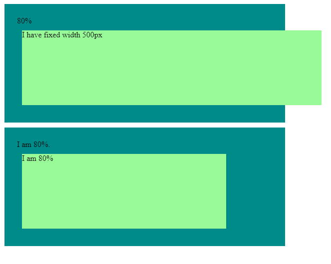

# DAY 01

- By default HTML behave responsively
- if it's not responsive there is issue with CSS.

## Percentage vs fixed width

- fixed width such as pixels (px), inches (in), or centimeters (cm) etc., it remove the responsiveness from the element.
- Whereas percentage widths allow for responsive designs because the element's width adjusts automatically based on the parent container's size.

### When there is no width

The behavior of an element without a specified width depends on its display property.

- By default, block-level elements (e.g., `<div>`, `<p>`, `<h1>`, etc.) have a width of 100% of their parent container's width.
- Inline elements (e.g., `<span>`, `<a>`, `<strong>`, etc.) do not have a width property by default. They adjust their width based on the content they contain, expanding horizontally as necessary.

### Parent and Child element

```HTML
<div class="parent">
 <div class="child"></div>
</div>
```

- If both the parent and child elements are block-level elements (e.g., `<div>`), the child element will expand to fill the available width of the parent element by default.
- If both the parent and child elements are block-level elements (e.g., `<div>`), and the parent has a specified width, the child element will adjust its width to fit the content within the parent's width.
- If the parent element is a block-level element, but the child element is an inline element (e.g., `<span>`, `<a>`, `<strong>`), the child element's width will be determined by its content.

Example: <https://codepen.io/ujjawalsingh/pen/YzRqbQp?editors=1100>

<p class="codepen" data-height="300" data-theme-id="dark" data-default-tab="html,result" data-slug-hash="YzRqbQp" data-preview="true" data-editable="true" data-user="ujjawalsingh" style="height: 300px; box-sizing: border-box; display: flex; align-items: center; justify-content: center; border: 2px solid; margin: 1em 0; padding: 1em;">
  <span>See the Pen <a href="https://codepen.io/ujjawalsingh/pen/YzRqbQp">
  CRL : Day 01-01</a> by Ujjawal Singh (<a href="https://codepen.io/ujjawalsingh">@ujjawalsingh</a>)
  on <a href="https://codepen.io">CodePen</a>.</span>
</p>
<script async src="https://cpwebassets.codepen.io/assets/embed/ei.js"></script>

### When deciding between percentage and fixed width, consider the following factors

- If your design requires flexibility and responsiveness, percentage widths are often preferred. If you need elements to maintain specific dimensions consistently, fixed widths may be more suitable.
- Different types of content may benefit from different approaches. For text-based content, a fluid, responsive layout might be more appropriate, whereas images or graphical elements may require fixed dimensions for precise control.

## Percentage vs fixed width on the child element

- if child element has fixed width it's going to be overflowing out of the parent. However we can hide it by using CSS property called: `overflow`.
- and if child has percentage then it will be respective of it's parent. For example parent and child width is set to 80% then this parent's 80% will be according to body or the screen size, but child's 80% will be according to it's parent.



Example:

<iframe height="300" style="width: 100%;" scrolling="no" title="CRL : Day 01-02" src="https://codepen.io/ujjawalsingh/embed/preview/oNQxRdz?default-tab=html%2Cresult&editable=true&theme-id=dark" frameborder="no" loading="lazy" allowtransparency="true" allowfullscreen="true">
  See the Pen <a href="https://codepen.io/ujjawalsingh/pen/oNQxRdz">
  CRL : Day 01-02</a> by Ujjawal Singh (<a href="https://codepen.io/ujjawalsingh">@ujjawalsingh</a>)
  on <a href="https://codepen.io">CodePen</a>.
</iframe>

## Extra

Em vs rem - <https://youtu.be/_-aDOAMmDHI>

## Challenge #1

- [Day01-Challenge01-problem](./Challenge%2001/problem/)
- [Day01-Challenge01-solution](./Challenge%2001/solution/)

<p class="codepen" data-height="300" data-theme-id="dark" data-default-tab="html,result" data-slug-hash="NWOVJBW" data-preview="true" data-editable="true" data-user="ujjawalsingh" style="height: 300px; box-sizing: border-box; display: flex; align-items: center; justify-content: center; border: 2px solid; margin: 1em 0; padding: 1em;">
  <span>See the Pen <a href="https://codepen.io/ujjawalsingh/pen/NWOVJBW">
  CRL : Day 01 Challenge-1</a> by Ujjawal Singh (<a href="https://codepen.io/ujjawalsingh">@ujjawalsingh</a>)
  on <a href="https://codepen.io">CodePen</a>.</span>
</p>
<script async src="https://cpwebassets.codepen.io/assets/embed/ei.js"></script>
