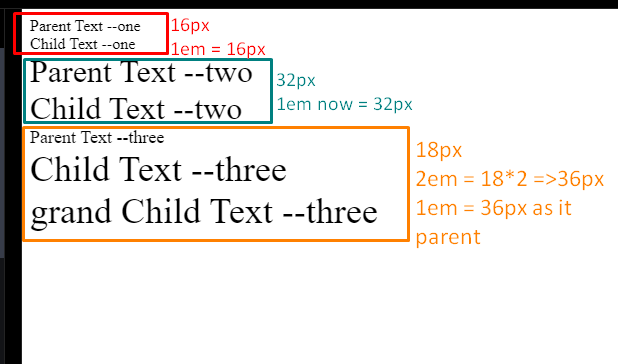

# Day 2 Relative Units

- <https://www.youtube.com/watch?v=_-aDOAMmDHI&feature=youtu.be>

## Why should not use em for font-size

- The em unit is relative to the font-size of its nearest parent element. If nested elements also use em for font-size, it creates a compounding effect. This can lead to unpredictable and unintended changes in font sizes throughout the nested elements, especially if there are multiple levels of nesting. It can make it challenging to maintain consistent font sizes and control the overall typography.
- The em unit inherits its value from its parent element, which can cause unexpected font-size changes. If the parent element's font-size is modified, all child elements using em for font-size will be affected. This can result in inconsistent font sizes when working with complex layouts.

**Example:**

```HTML
<style>
  .parent-one {
    font-size: 16px;
  }

  .child {
    font-size: 1em;
    /* in this cas 1em = 16px*/
  }

  .parent-two {
    font-size: 32px;
  }

  .parent-three {
    font-size: 18px;
  }

  .child-three {
    font-size: 2em;
  }
</style>

<div class="parent-one">
  Parent Text --one
  <div class="child">
    Child Text --one
  </div>
</div>

<div class="parent-two">
  Parent Text --two
  <div class="child">
    Child Text --two
  </div>
</div>

<div class="parent-three">
  Parent Text --three
  <div class="child-three">
    Child Text --three
    <div class="grand-child">
      grand Child Text --three
    </div>
  </div>
</div>
```



<p class="codepen" data-height="300" data-theme-id="dark" data-default-tab="html,result" data-slug-hash="mdQPZVL" data-user="ujjawalsingh" style="height: 300px; box-sizing: border-box; display: flex; align-items: center; justify-content: center; border: 2px solid; margin: 1em 0; padding: 1em;">
  <span>See the Pen <a href="https://codepen.io/ujjawalsingh/pen/mdQPZVL">
  CRL : Day 02-01</a> by Ujjawal Singh (<a href="https://codepen.io/ujjawalsingh">@ujjawalsingh</a>)
  on <a href="https://codepen.io">CodePen</a>.</span>
</p>

Instead of em, it is often recommended to use rem (root em) for font-size. The rem unit is relative to the root element's font-size (typically the `<html>` element), providing a consistent reference point across the document. This makes it easier to maintain a consistent font-size hierarchy throughout the page and offers better control over font scaling.

<p class="codepen" data-height="300" data-theme-id="dark" data-default-tab="html,result" data-slug-hash="PoxNrWx" data-user="ujjawalsingh" style="height: 300px; box-sizing: border-box; display: flex; align-items: center; justify-content: center; border: 2px solid; margin: 1em 0; padding: 1em;">
  <span>See the Pen <a href="https://codepen.io/ujjawalsingh/pen/PoxNrWx">
  CRL : Day 02-02</a> by Ujjawal Singh (<a href="https://codepen.io/ujjawalsingh">@ujjawalsingh</a>)
  on <a href="https://codepen.io">CodePen</a>.</span>
</p>
