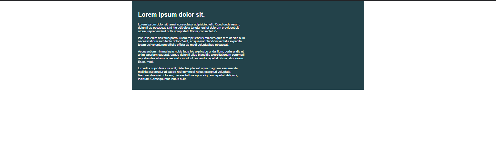

# Day 03

## max-width

setting a fixed width on an element tends to be a bad idea. Instead we can use percentages, which make our lives easier.

The only issue with this is, at large screens, things can get too big. Thankfully, we have max-width that can help us out!

## Challenge 02

- [Day03-Challenge02-problem](./Challenge%2002/problem/)
- [Day03-Challenge02-solution](./Challenge%2002/solution/)
  
Codepen Solution Link:

  See the Pen <a href="https://codepen.io/ujjawalsingh/pen/RwemXbd">
  CRL : Day 03 Challenge-2</a> by Ujjawal Singh (<a href="https://codepen.io/ujjawalsingh">@ujjawalsingh</a>)
  on <a href="https://codepen.io">CodePen</a>.

