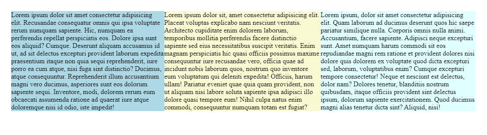
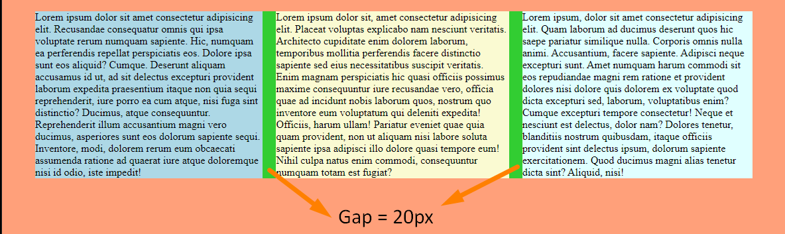

# Day 08 Flexbox basics

`display:flex`
it convert all the children into columns. squeeze  them within 100

  See the Pen <a href="https://codepen.io/ujjawalsingh/pen/NWENZoP">
  CRL : Day 08-01</a> by Ujjawal Singh (<a href="https://codepen.io/ujjawalsingh">@ujjawalsingh</a>)
  on <a href="https://codepen.io">CodePen</a>.

## add space between columns

- using `gap`
- or `col+col` property  

  See the Pen <a href="https://codepen.io/ujjawalsingh/pen/dyQMBrq">
  CRL : Day 08-02</a> by Ujjawal Singh (<a href="https://codepen.io/ujjawalsingh">@ujjawalsingh</a>)
  on <a href="https://codepen.io">CodePen</a>.

## Challenge

- [Day08-Challenge04-problem](./Challenge04/problem/)
- [Day08-Challenge04-solution](./Challenge04/solution/)

  See the Pen <a href="https://codepen.io/ujjawalsingh/pen/vYQEmNV">
  CRL : Day 08 Challenge-4 Flexbox-1</a> by Ujjawal Singh (<a href="https://codepen.io/ujjawalsingh">@ujjawalsingh</a>)
  on <a href="https://codepen.io">CodePen</a>.

